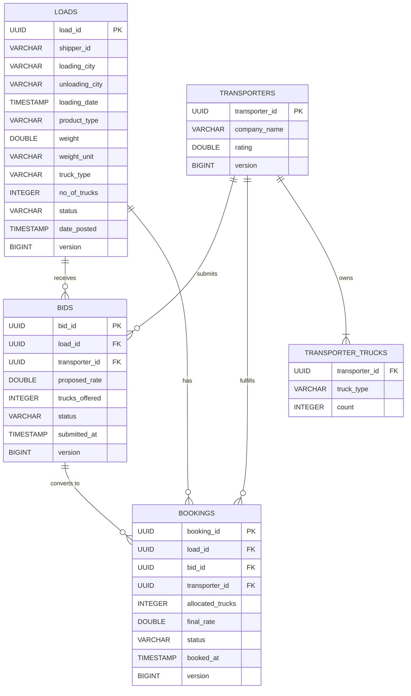

# 🚚 TMS CargoPro - Transport Management System

[](https://www.oracle.com/java/)
[](https://spring.io/projects/spring-boot)
[](https://www.postgresql.org/)
[](https://opensource.org/licenses/MIT)

A comprehensive **Transport Management System (TMS)** backend API for managing loads, transporters, bids, and bookings. This system facilitates seamless coordination between shippers posting loads and transporters bidding on them.

---

## 📋 Table of Contents

- [Features](#-features)
- [Tech Stack](#-tech-stack)
- [Project Structure](#-project-structure)
- [Database Schema](#-database-schema)
- [Getting Started](#-getting-started)
- [API Documentation](#-api-documentation)
- [Environment Variables](#-environment-variables)
- [API Endpoints](#-api-endpoints)
- [Business Logic](#-business-logic)
- [Test Coverage](#-test-coverage)
- [Contributing](#-contributing)
- [License](#-license)

---

## ✨ Features

### Core Functionality
- 📦 **Load Management**: Create, track, and manage shipment loads
- 🚛 **Transporter Management**: Register transporters with available truck fleets
- 💰 **Bidding System**: Transporters can submit competitive bids on loads
- 📝 **Booking System**: Accept bids and create confirmed bookings
- 🔒 **Optimistic Locking**: Prevent race conditions during concurrent bookings
- 📊 **Smart Bid Ranking**: Algorithm-based bid scoring (70% rate, 30% rating)

### Technical Features
- ✅ Input validation with Bean Validation
- 🔄 RESTful API design
- 📖 OpenAPI/Swagger documentation
- 🗃️ PostgreSQL with JPA/Hibernate
- 🎯 Exception handling with custom error responses
- 📈 Pagination support for list endpoints
- 🔍 Advanced filtering and search capabilities

---

## 🛠️ Tech Stack

### Backend
- **Java 25** - Programming Language
- **Spring Boot 4.0.0** - Application Framework
- **Spring Data JPA** - Data Access Layer
- **Hibernate** - ORM Framework
- **Spring Web MVC** - RESTful Web Services

### Database
- **PostgreSQL** - Relational Database

### Documentation & Tools
- **SpringDoc OpenAPI 2.7.0** - API Documentation (Swagger UI)
- **Lombok** - Boilerplate Code Reduction
- **Maven** - Build & Dependency Management
- **Bean Validation** - Input Validation

---

## 📁 Project Structure

```
TMS_CargoPro/
├── src/
│   ├── main/
│   │   ├── java/org/example/tms_cargopro/
│   │   │   ├── TmsCargoProApplication.java       # Main Application Entry Point
│   │   │   ├── config/
│   │   │   │   └── OpenApiConfig.java            # Swagger/OpenAPI Configuration
│   │   │   ├── controller/                       # REST Controllers
│   │   │   │   ├── BidController.java            # Bid Management Endpoints
│   │   │   │   ├── BookingController.java        # Booking Management Endpoints
│   │   │   │   ├── LoadController.java           # Load Management Endpoints
│   │   │   │   └── TransporterController.java    # Transporter Management Endpoints
│   │   │   ├── dto/                              # Data Transfer Objects
│   │   │   │   ├── request/                      # Request DTOs
│   │   │   │   │   ├── BidRequest.java
│   │   │   │   │   ├── BookingRequest.java
│   │   │   │   │   ├── LoadRequest.java
│   │   │   │   │   ├── TransporterRequest.java
│   │   │   │   │   └── UpdateTrucksRequest.java
│   │   │   │   └── response/                     # Response DTOs
│   │   │   │       ├── BestBidResponse.java
│   │   │   │       ├── BidResponse.java
│   │   │   │       ├── BookingResponse.java
│   │   │   │       ├── LoadResponse.java
│   │   │   │       └── TransporterResponse.java
│   │   │   ├── entity/                           # JPA Entities
│   │   │   │   ├── AvailableTruck.java          # Embeddable for truck details
│   │   │   │   ├── Bid.java                     # Bid Entity
│   │   │   │   ├── Booking.java                 # Booking Entity
│   │   │   │   ├── Load.java                    # Load Entity
│   │   │   │   └── Transporter.java             # Transporter Entity
│   │   │   ├── enums/                            # Enumerations
│   │   │   │   ├── BidStatus.java               # PENDING, ACCEPTED, REJECTED
│   │   │   │   ├── BookingStatus.java           # CONFIRMED, COMPLETED, CANCELLED
│   │   │   │   ├── LoadStatus.java              # POSTED, OPEN_FOR_BIDS, BOOKED, CANCELLED
│   │   │   │   └── WeightUnit.java              # TON, KG
│   │   │   ├── exception/                        # Exception Handling
│   │   │   │   ├── ConflictException.java
│   │   │   │   ├── ErrorResponse.java
│   │   │   │   ├── GlobalExceptionHandler.java
│   │   │   │   ├── InsufficientCapacityException.java
│   │   │   │   ├── InvalidStatusException.java
│   │   │   │   ├── LoadAlreadyBookedException.java
│   │   │   │   └── ResourceNotFoundException.java
│   │   │   ├── mapper/
│   │   │   │   └── EntityMapper.java            # Entity to DTO Mapping
│   │   │   ├── repository/                       # Data Access Layer
│   │   │   │   ├── BidRepository.java
│   │   │   │   ├── BookingRepository.java
│   │   │   │   ├── LoadRepository.java
│   │   │   │   └── TransporterRepository.java
│   │   │   └── service/                          # Business Logic Layer
│   │   │       ├── impls/
│   │   │       │   ├── BidServiceImpl.java
│   │   │       │   ├── BookingServiceImpl.java
│   │   │       │   ├── LoadServiceImpl.java
│   │   │       │   └── TransporterServiceImpl.java
│   │   │       ├── BidService.java
│   │   │       ├── BookingService.java
│   │   │       ├── LoadService.java
│   │   │       └── TransporterService.java
│   │   └── resources/
│   │       ├── application.properties            # Application Configuration
│   │       ├── static/
│   │       └── templates/
│   └── test/
│       └── java/org/example/tms_cargopro/
│           └── TmsCargoProApplicationTests.java
├── pom.xml                                       # Maven Configuration
├── mvnw                                          # Maven Wrapper (Unix)
├── mvnw.cmd                                      # Maven Wrapper (Windows)
└── README.md                                     # Project Documentation
```

---

## 🗄️ Database Schema

### Entity Relationship Diagram




---

## 🚀 Getting Started

### Prerequisites

- **Java 25** or later
- **Maven 3.6+**
- **PostgreSQL 12+**
- **Git**

### Installation Steps

1. **Clone the repository**
   ```bash
   git clone https://github.com/yourusername/TMS_CargoPro.git
   cd TMS_CargoPro
   ```

2. **Configure PostgreSQL Database**
   ```sql
   CREATE DATABASE tms_cargopro;
   ```

3. **Set Environment Variables**

   Create a `.env` file or set environment variables:
   ```properties
   DB_USER=your_postgres_username
   DB_PASS=your_postgres_password
   ```

   Or export them in your terminal:
   ```bash
   # Windows PowerShell
   $env:DB_USER="your_postgres_username"
   $env:DB_PASS="your_postgres_password"

   # Linux/Mac
   export DB_USER=your_postgres_username
   export DB_PASS=your_postgres_password
   ```

4. **Build the project**
   ```bash
   ./mvnw clean install
   ```

5. **Run the application**
   ```bash
   ./mvnw spring-boot:run
   ```

6. **Access the application**
    - Application: `http://localhost:8080`
    - Swagger UI: `http://localhost:8080/swagger-ui.html`
    - API Docs JSON: `http://localhost:8080/api-docs`

---

## 📖 API Documentation

### Swagger/OpenAPI Documentation

The API is fully documented using **OpenAPI 3.0** specification with **Swagger UI**.

**Access Swagger UI:** [http://localhost:8080/swagger-ui.html](http://localhost:8080/swagger-ui.html)

**OpenAPI JSON:** [http://localhost:8080/api-docs](http://localhost:8080/api-docs)

### Postman Collection

[📥 Download Postman Collection](./tms-cargopro.postman_collection.json)


---

## 🔐 Environment Variables

| Variable | Description | Required | Default |
|----------|-------------|----------|---------|
| `DB_USER` | PostgreSQL username | Yes | - |
| `DB_PASS` | PostgreSQL password | Yes | - |
| `SERVER_PORT` | Application port | No | 8080 |

---

## 🔌 API Endpoints

### Load Management

| Method | Endpoint | Description |
|--------|----------|-------------|
| POST | `/api/load` | Create a new load |
| GET | `/api/load` | Get loads (with filters & pagination) |
| GET | `/api/load/{loadId}` | Get load by ID |
| GET | `/api/load/{loadId}/best-bids` | Get best bids for a load |
| PATCH | `/api/load/{loadId}/cancel` | Cancel a load |

### Transporter Management

| Method | Endpoint | Description |
|--------|----------|-------------|
| POST | `/api/transporter` | Register a new transporter |
| GET | `/api/transporter/{id}` | Get transporter by ID |
| PUT | `/api/transporter/{id}/trucks` | Update available trucks |

### Bid Management

| Method | Endpoint | Description |
|--------|----------|-------------|
| POST | `/api/bid` | Submit a new bid |
| GET | `/api/bid` | Get bids (with filters) |
| GET | `/api/bid/{bidId}` | Get bid by ID |
| PATCH | `/api/bid/{bidId}/reject` | Reject a bid |

### Booking Management

| Method | Endpoint | Description |
|--------|----------|-------------|
| POST | `/api/booking` | Create a booking (accept bid) |
| GET | `/api/booking/{id}` | Get booking by ID |
| PATCH | `/api/booking/{id}/cancel` | Cancel a booking |

---

## 💼 Business Logic

### Bid Scoring Algorithm

Bids are ranked using a weighted scoring algorithm:

```
Score = (1 / proposed_rate) × 0.7 + (transporter_rating / 5) × 0.3
```

- **70%** weight on competitive pricing (lower rate = higher score)
- **30%** weight on transporter rating (higher rating = higher score)

### Load Lifecycle

```
POSTED → OPEN_FOR_BIDS → BOOKED → (CANCELLED)
```

### Bid Lifecycle

```
PENDING → ACCEPTED/REJECTED
```

### Booking Lifecycle

```
CONFIRMED → COMPLETED/CANCELLED
```

### Concurrency Control

- **Optimistic Locking** using `@Version` annotation
- Prevents double-booking of loads
- Ensures truck availability consistency

---

## 📊 Example Requests

### 1. Create a Transporter

```json
POST /api/transporter
{
  "companyName": "FastFreight Logistics",
  "rating": 4.5,
  "availableTrucks": [
    {
      "truckType": "Container",
      "count": 10
    },
    {
      "truckType": "Open",
      "count": 5
    }
  ]
}
```

### 2. Create a Load

```json
POST /api/load
{
  "shipperId": "SHIP001",
  "loadingCity": "Mumbai",
  "unloadingCity": "Delhi",
  "loadingDate": "2025-12-15T10:00:00Z",
  "productType": "Electronics",
  "weight": 5.5,
  "weightUnit": "TON",
  "truckType": "Container",
  "noOfTrucks": 2
}
```

### 3. Submit a Bid

```json
POST /api/bid
{
  "loadId": "550e8400-e29b-41d4-a716-446655440000",
  "transporterId": "660e8400-e29b-41d4-a716-446655440001",
  "proposedRate": 25000.00,
  "trucksOffered": 2
}
```

### 4. Create a Booking

```json
POST /api/booking
{
  "bidId": "770e8400-e29b-41d4-a716-446655440002",
  "allocatedTrucks": 2
}
```

---

## 🤝 Contributing

Contributions are welcome! Please follow these steps:

1. Fork the repository
2. Create a feature branch (`git checkout -b feature/AmazingFeature`)
3. Commit your changes (`git commit -m 'Add some AmazingFeature'`)
4. Push to the branch (`git push origin feature/AmazingFeature`)
5. Open a Pull Request

---

## 📝 License

This project is licensed under the **MIT License** - see the [LICENSE](LICENSE) file for details.
---

**Made with ❤️ by Lakshay Jain**